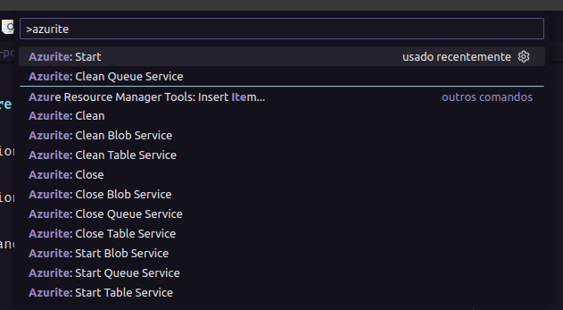
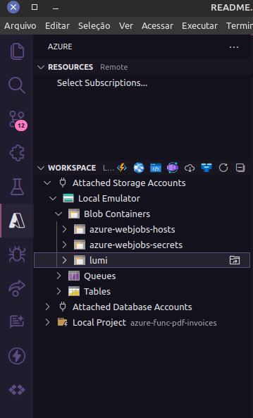
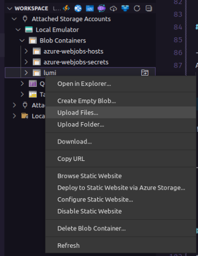

# 💻 Projeto azure-func-pdf-invoices

Funcionalidade do Azure function:
Leitura dos PDF conta de Energia dos cliente
Tratamento de dados de formas estruturada,
Carregamento de dados para banco de dados SQL

## ✨ Tecnologias

Esse projeto foi desenvolvido com as seguintes tecnologias:

- [Python](https://www.python.org/)
- [Azure Functions](https://docs.microsoft.com/pt-br/azure/azure-functions/)
- [Python Pandas](https://pandas.pydata.org/)
- [Azure Blob](https://docs.microsoft.com/en-us/azure/storage/blobs/storage-quickstart-blobs-python)
- [ORM Sqlalchemy](https://www.sqlalchemy.org/)

## 🚀 Instalações

Clone o repositório:
https://github.com/IsakielSouza/azure-func-pdf-invoices

Renomeie o arquivo:
`local.settings.json.example` para `local.settings.json`

Preencha os valores da variáveis para ambiente de desenvolvimento:
{
  ...
  "AzureWebJobsStorage": "UseDevelopmentStorage=true",
}

Instale a versão mais recente do Python
  https://www.python.org/downloads/ ou https://python.org.br/instalacao-linux/
  
  criando alis para python3
  
  execute no terminal: 
  - alias python=python3

## Create Virtual environment

Pasta do projeto execute terminal: 

- sudo apt-get install python3-venv

- python -m venv .venv

ativá-lo modo venv:

- source .venv/bin/activate

- pip install -r requirements.txt

## VSCode

Extensões Marketplace VSCode:
- Azure Functions
- Azure Tools

## Instalação Azure core tools
 
- npm i -g azure-functions-core-tools@4 --unsafe-perm true
ou 
- yarn add azure-functions-core-tools@4 --unsafe-perm true

 Apos instalação o comando 'func' estará disponível no terminal
- func --v
exe: 4.0.5455
  
https://github.com/Azure/azure-functions-core-tools#installing

## Iniciando Emulador Storage Explorer

## start azurite
com vscode aberto no projeto pressione va nas configurações Crtl + Shift + P F1
procure na barra de pesquisa '>azurite'
selecione Azurite:start

## Azure Workspace

- Criando Container de blob:
Attached Storage Accounts
  Local Emulator:
    Create Blob Container...
      para esse exemplo crie um container com nome: lumi

- para adicionar arquivos manuais ao container
  realize upload com explorer selecione arquivo e aguarde.

  

# Replicando ambientes

exportarmos um arquivo com todas bibliotecas que o nosso projeto contém

- pip freeze > requirements.txt

Com o comando acima, será criado um arquivo com todas as bibliotecas presentes em nosso ambiente virtual.

# Mais info:

## Azure Functions developer guide
https://learn.microsoft.com/en-us/azure/azure-functions/functions-reference?tabs=blob&pivots=programming-language-python

## Azure Functions Python developer guide
https://learn.microsoft.com/en-us/azure/azure-functions/functions-reference-python?tabs=asgi%2Capplication-level&pivots=python-mode-decorators